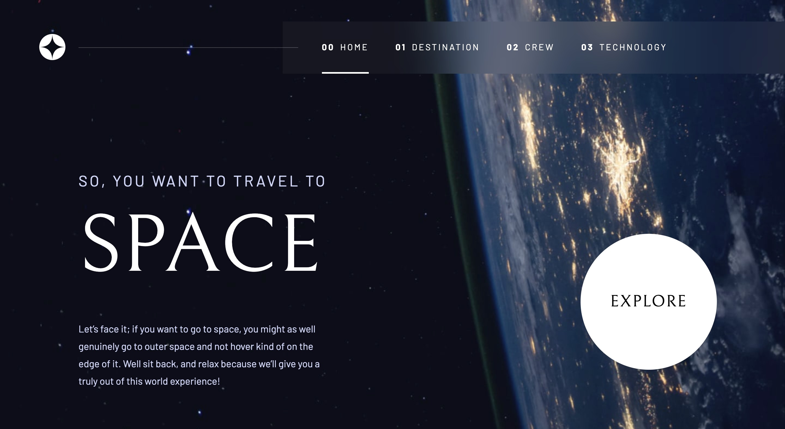
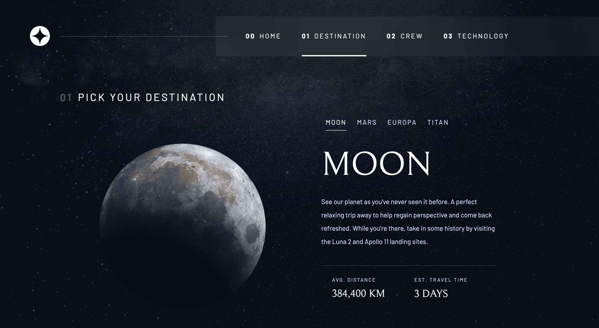
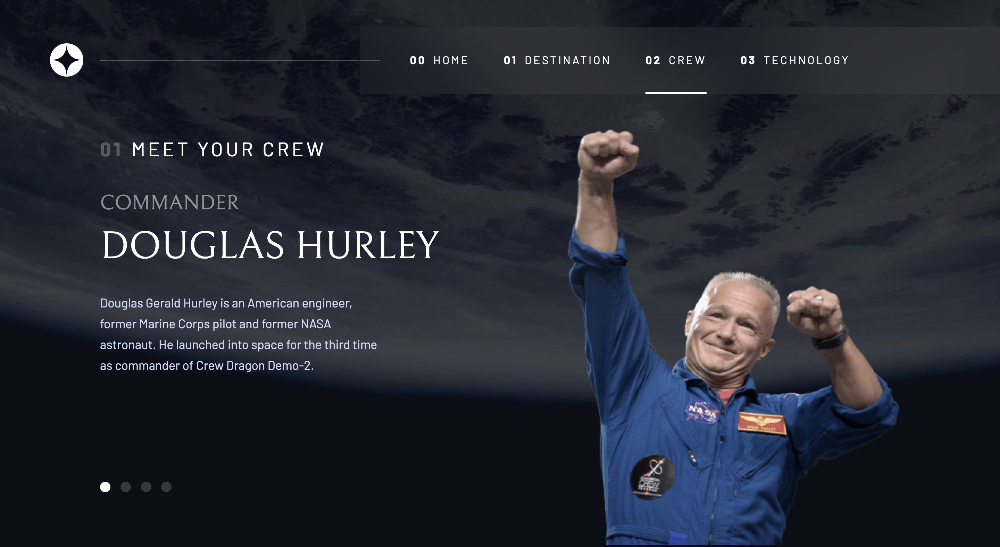
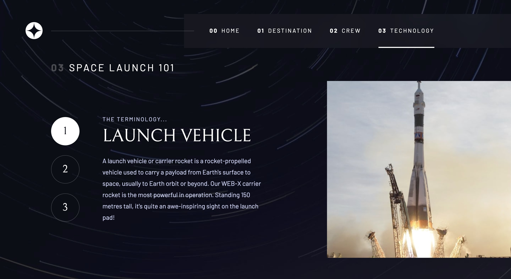
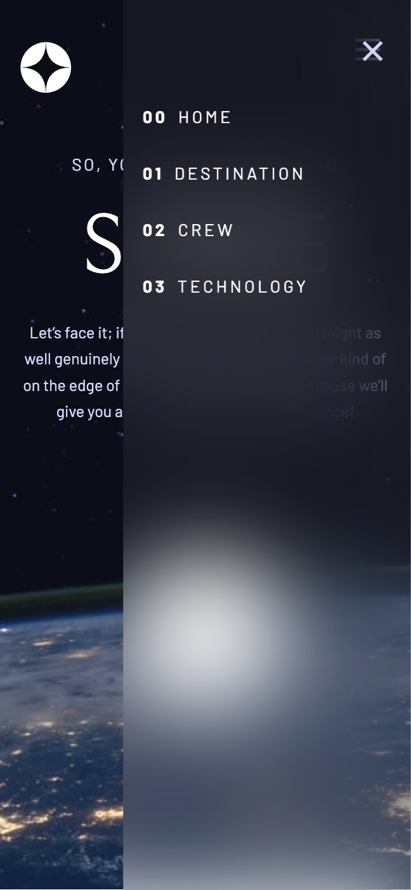

# Frontend Mentor - Space tourism website solution

### Screenshot

### Links

- Solution URL: [https://github.com/Ameerusa86/Challenge-2---Space-tourism-multi-page-website/tree/master/space-frontend-mentor]
- Live Site URL: [https://space-tourism2023.netlify.app]

## My process

### Built with

- Semantic HTML5 markup
- CSS custom properties
- Flexbox
- CSS Grid
- Desktop-first workflow
- [React](https://reactjs.org/) - JS library
